# MySQL as a Library

### The architecture of an isomorphic, in-process MySQL for JavaScript

> **Abstract.** We are building a MySQL you `import` rather than run. It has
> no server process, no native addon and no WebAssembly build of `mysqld`. It
> is a reimplementation in TypeScript that speaks MySQL's wire protocol,
> follows MySQL's semantics, and reads and writes MySQL's tablespace format.
> It runs in Node, Deno, Bun and the browser, from the same code.
>
> The design rests on one observation. "MySQL compatible" is three promises,
> not one, and they cost very different amounts to keep. The wire protocol is
> small and buys the whole driver ecosystem at once. SQL semantics is where the
> real engineering lives. The file format matters, but it can be kept apart
> from the rest. Most of the architecture follows from taking each promise
> seriously at its own price, and from refusing to let any of them leak into
> the others.

This paper describes the **target architecture**: the system as it is meant to
stand at 1.0. Much of it is already built, and some of it is not. Where a
diagram shows something that does not exist yet, it is drawn dashed:

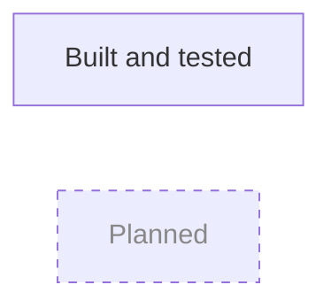

For what is done this week, the [roadmap](./docs/44-roadmap.md) is the only
source of truth. This document says *what* and *why*. The roadmap says *how
far along*. [§21](#21-where-we-are) has a dated snapshot.

---

## Contents

1. [The problem](#1-the-problem)
2. [Why not compile MySQL to WebAssembly?](#2-why-not-compile-mysql-to-webassembly)
3. [Three contracts](#3-three-contracts)
4. [The shape of the system](#4-the-shape-of-the-system)
5. [Three seams that carry the design](#5-three-seams-that-carry-the-design)
6. [One query, end to end](#6-one-query-end-to-end)
7. [Speaking MySQL](#7-speaking-mysql)
8. [The part everyone gets wrong: types and collations](#8-the-part-everyone-gets-wrong-types-and-collations)
9. [From text to rows](#9-from-text-to-rows)
10. [Storage: a file you can trust](#10-storage-a-file-you-can-trust)
11. [Transactions with one writer](#11-transactions-with-one-writer)
12. [Durability, stated honestly](#12-durability-stated-honestly)
13. [Engines behind one interface](#13-engines-behind-one-interface)
14. [Where it runs](#14-where-it-runs)
15. [Bringing your data: InnoDB interchange](#15-bringing-your-data-innodb-interchange)
16. [The log is a product](#16-the-log-is-a-product)
17. [The API you hold](#17-the-api-you-hold)
18. [How we know it works](#18-how-we-know-it-works)
19. [What we gave up, on purpose](#19-what-we-gave-up-on-purpose)
20. [What we don't know yet](#20-what-we-dont-know-yet)
21. [Where we are](#21-where-we-are)
22. [Further reading](#22-further-reading)

---

## 1. The problem

If your application runs on MySQL, every test that touches the database needs a
MySQL server. That usually means a Docker container, a CI service, a port and a
startup wait. Your prototype in the browser can't have one at all. A demo,
a tutorial or an offline-first app that wants "the same database as
production" settles for something that is not MySQL. The differences
then turn up later as bugs: SQLite's type affinity, a different collation, a
`GROUP BY` that is legal in one engine and not the other.

Other databases solved this a while ago. SQLite was always a library.
[PGlite](https://pglite.dev) made Postgres one by compiling it to WebAssembly.
MySQL, still one of the most deployed databases in the world, has no
equivalent. We want this:

```js
import { MySQL } from 'myjs'

const db = await MySQL.open('opfs://app-db')   // browser: persistent, in OPFS
const db = await MySQL.open('./data')          // Node: a directory on disk
const db = await MySQL.open(':memory:')        // either: gone when you close it

const [rows] = await db.execute('SELECT * FROM users WHERE id = ?', [1])
```

We also want the existing ecosystem to work against it unchanged:

```js
import mysql from 'mysql2/promise'

const conn = await mysql.createConnection({ stream: db.createStream() })
// Drizzle, Prisma, Knex, Kysely, TypeORM… sit on top of this as they always do
```

That second snippet matters more than the first. `mysql2` has no idea there is
no socket. It does its handshake, authenticates, prepares statements and reads
resultsets as it would against a server in a data centre, because as far as
the bytes are concerned it is talking to one.

The goal in one line: **SQLite's ergonomics, PGlite's delivery model, MySQL's
semantics.**

## 2. Why not compile MySQL to WebAssembly?

This is the first question everyone asks, and it deserves a real answer. Porting
is what PGlite did for Postgres, and it worked brilliantly. It worked because
Postgres has four properties that MySQL lacks.

| | Postgres | MySQL |
|---|---|---|
| **A single-user mode** | `postgres --single` runs the whole backend as one process that reads a query and writes a result | None. Bootstrap mode creates a datadir; it does not serve queries |
| **Threading** | Processes, and parallelism is optional | InnoDB starts about twenty threads at boot: log writer, flusher, checkpointer, page cleaner, purge coordinator and workers, and more. Durability and MVCC garbage collection depend on them making progress |
| **Build** | Modest C dependencies Emscripten already handles | Bison, host-tool bootstrapping, and OpenSSL, ICU, protobuf, Boost, zstd, LZ4… A bundle in the tens of megabytes |
| **Licence** | BSD-like | **GPLv2** |

The threading row alone would make a port a rewrite of InnoDB's hardest code
into a cooperative scheduler. Emscripten's pthreads need `SharedArrayBuffer`,
which needs cross-origin isolation headers. Those headers break third-party
embeds, and asking every user to set them is a heavy price for a library
whose pitch is "just import it".

The licence row is decisive on its own. A WebAssembly build of MySQL is a
derivative work of MySQL. An npm package that ships it, and every application
that bundles it, takes on GPLv2 obligations. For a library meant to be dropped
into any web or Node application, that decides who can use it at all.

So we reimplement. This repository is MIT, and it keeps a strict rule: nothing
from MySQL's source tree is ever copied into it, tests included. We read
MySQL's source to learn facts: a constant, a byte layout, which of two
behaviours the server picks. We write our own code from those facts.

Being honest about the choice means saying when it would be wrong. If the
goal were bug-for-bug fidelity, meaning an existing workload's stored
procedures and every optimiser quirk running untouched, no reimplementation
would get there. If someone shipped a genuinely single-threaded InnoDB, the
technical objection would mostly go away. [Doc 02](./docs/02-strategy.md)
makes the full argument, including the "port only InnoDB" middle path and why
we reject it.

## 3. Three contracts

"MySQL compatible" means nothing until you say *at which layer*. We commit to
three, in priority order. Most of the architecture comes from treating them as
separate promises with separate prices.

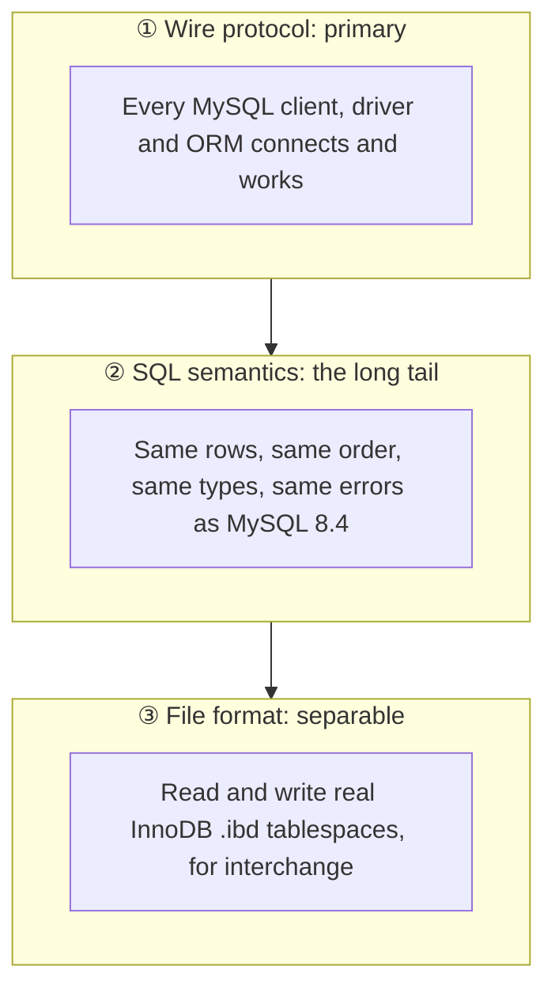

*Read top to bottom as "what we do first". The arrows are dependency, not
importance: a file importer is no use if nothing can query what it imports.*

| Contract | Cost | What it buys | Verdict |
|---|---|---|---|
| **Wire protocol** | Low: a few thousand lines, fully specified | The entire driver and ORM ecosystem, which then also serves as our conformance suite | Do it first |
| **SQL semantics** | High: this is the real engineering | What "MySQL" actually means to a user | Grow it by measured demand |
| **InnoDB format** | Medium: well understood, decoded in docs 21–24 | Data portability, migration, forensics | A separate module; interchange, never native storage |

The first contract is the bargain. The protocol is a narrow, stable, documented
interface. Implementing it makes `mysql2`, `mariadb`, Prisma, Drizzle, the
`mysql` command-line client and every tool built on them work at once. Those
clients then test us for free: if a driver's own test suite passes, we are
compatible in exactly the sense its users care about.

The second contract is where "MySQL-compatible" projects usually fail without
anyone noticing. A query that returns `X` on MySQL 8.4 has to return `X` here,
which means the same collation ordering, the same implicit coercions, the same
`sql_mode` behaviour, the same `AUTO_INCREMENT` and `TIMESTAMP` rules, and
the same integer division. [§8](#8-the-part-everyone-gets-wrong-types-and-collations)
is about why that is harder than it sounds.

The third contract is subtler. It would be natural to make InnoDB's on-disk
format our own, and we decided not to. A `.ibd` file a real server will *serve*
needs more than valid pages. It also needs MySQL's internal data dictionary,
a version-matched redo log and instant-DDL row versioning, and MySQL does not
promise that any of those survive its own version upgrades. What MySQL
*does* document is **transportable tablespaces**: `FLUSH TABLES … FOR EXPORT`
produces a `.ibd` and a `.cfg`, and `ALTER TABLE … IMPORT TABLESPACE` takes
them. That is the boundary we commit to. Our native storage is our own design,
deliberately close to InnoDB in its semantics so that behaviour matches,
without being chained to its bytes.

## 4. The shape of the system

### Layers

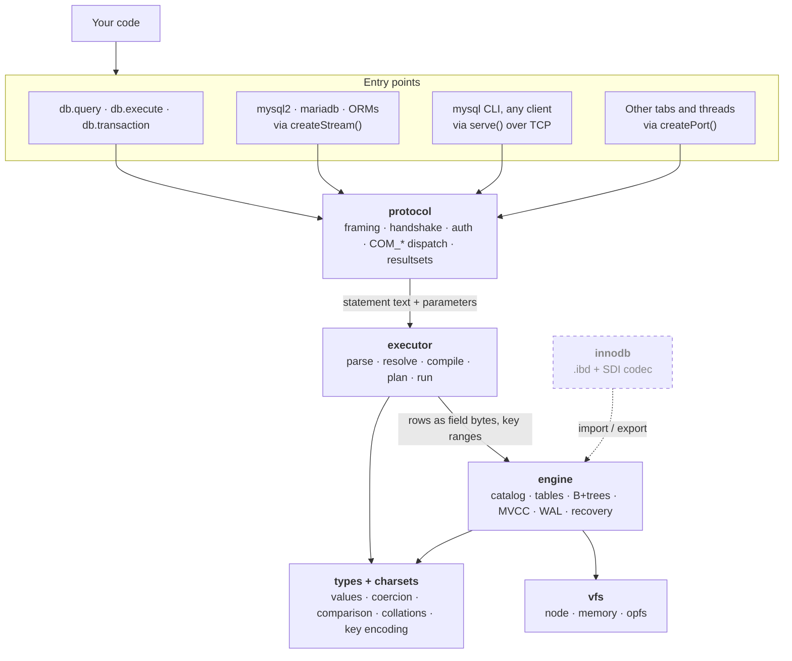

*Every entry point goes through the protocol layer. That includes the
convenience API: `db.query()` is a client of the same wire protocol that a
socket would carry.*

### Packages

The layers are enforced as npm workspace packages, and the edges between them
are rules, not preferences:

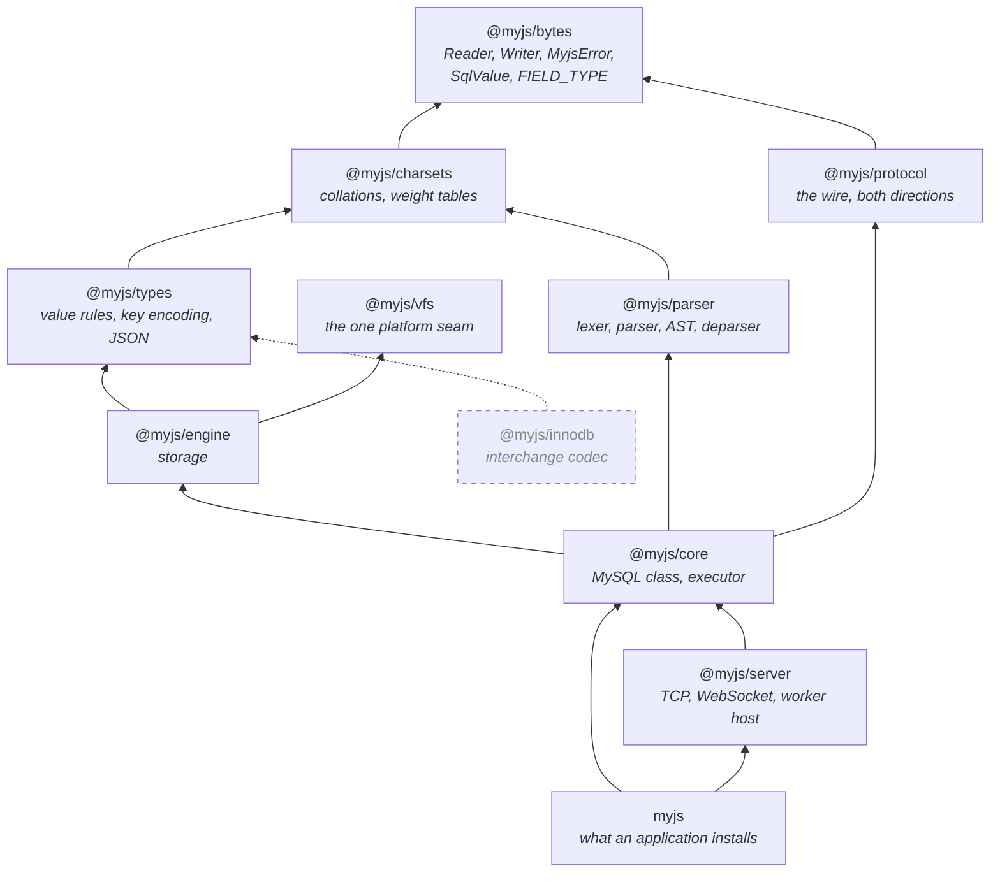

*Arrows point at what a package depends on. Transitive edges to `bytes` are
omitted. `@myjs/protocol` and `@myjs/charsets` never touch.*

The most important edge in that picture is the one that is missing. **The
protocol package never depends on charsets or types.** That is not a matter of
taste; it follows from the release plan. `@myjs/protocol` ships first, at 0.1,
as a standalone MySQL protocol toolkit, which JavaScript does not otherwise
have. `@myjs/charsets` and `@myjs/types` ship at 0.2. An edge from the first
to either of the others would make the 0.1 artefact unpublishable.

That forces a recurring question: what happens when two packages above both
need to *name* the same thing? `MyjsError`, the neutral `SqlValue` struct and
the `FIELD_TYPE` numbers are all needed by both protocol and types. Each time,
the answer has been to move the thing **down** into `@myjs/bytes`, under a
test for what belongs there. A *fact about the format* belongs in `bytes`; *behaviour* does
not. The number `MYSQL_TYPE_NEWDECIMAL = 246` is the same in a wire packet, a
binlog row image and a `.ibd` file, so it lives in `bytes`. What you do with a
DECIMAL lives in `types`. The protocol learns about a session's character set
by having a `Transcoder` *injected* into it. It never imports one.

`myjs` itself is a facade: it re-exports doc 42's surface from `@myjs/core`
and `serve()`, as `myjs/server`, from `@myjs/server` (D-79). The core cannot
be the package an application installs under that name, since `myjs/server`
would then depend on a package that depends on it. The facade also makes the
surface 1.0 freezes one short file rather than everything the core exports
for its neighbours. In the repository every package runs from its
TypeScript source; what npm installs is the JavaScript and declarations
`tsc` emits from it, packed and smoke-installed by CI, because Node will not
strip types inside `node_modules`.

`@myjs/innodb` is deliberately not under `@myjs/engine`. It is a codec, not a
storage backend. Someone should be able to `npm install @myjs/innodb` purely to
parse a tablespace they found on a dead server.

## 5. Three seams that carry the design

Three interfaces carry the architecture. Get them right and everything else
can change behind them. Get them wrong and no amount of work above or below
can make up for it.

### Seam one: `execProtocol(bytes) → bytes`

The lowest public entry point, borrowed from PGlite:

```ts
const response: Uint8Array = await db.execProtocol(request: Uint8Array)
```

MySQL packets go in and MySQL packets come out. Every other way of talking to the
database is a caller of this function, and that buys four things:

- **Driver interop is free.** `createStream()` is a thin duplex adapter over
  it, which is why `mysql2.createConnection({ stream })` works.
- **Transport is decoupled.** In-process, `MessagePort`, WebSocket and TCP are
  all just different pumps around the same function.
- **The protocol is testable in isolation.** We replay byte traces captured
  from a real MySQL server and compare our answers byte for byte.
- **Cross-thread and cross-tab access is uniform.** A worker that owns the
  database needs to expose exactly one method.

Behind it sits the engine's side of the contract, the `Executor` interface in
`@myjs/protocol`. That is how the protocol stays ignorant of SQL:

```ts
interface Executor {
  query(session: Session, sql: string, attributes: readonly Parameter[]): Promise<StatementResult | StatementResult[]>
  prepare(session: Session, sql: string): Promise<PreparedInfo>
  execute(session: Session, sql: string, parameters: readonly Parameter[]): Promise<StatementResult | StatementResult[]>
  reset?(session: Session): void   // COM_RESET_CONNECTION
  end?(session: Session): void     // the connection is gone: roll back
  // …and optional fieldList, initDb, statistics
}
```

### Seam two: the `Vfs`

The only platform-dependent code in the system is a small block-device
interface:

```ts
interface Vfs {
  readonly name: 'opfs' | 'node' | 'memory'
  readonly durability: 'strong' | 'best-effort'
  open(path: string, opts: { create?: boolean }): Promise<VfsFile>
  delete(path: string): Promise<void>
  list(dir: string): Promise<string[]>
  lock(path: string): Promise<Lock>          // cross-context exclusion
}

interface VfsFile {                          // synchronous once open
  readonly pageSize: number
  readPage(pageNo: number, into: Uint8Array): void
  writePage(pageNo: number, from: Uint8Array): void
  readBytes(offset: number, into: Uint8Array): number   // the log, headers
  writeBytes(offset: number, from: Uint8Array): void
  size(): number
  truncate(bytes: number): void
  flush(): void                              // the durability barrier
  close(): void
}
```

Two choices in it shape everything above. First, **it is synchronous once a
file is open.** Both platforms we care about offer synchronous I/O: OPFS's
`FileSystemSyncAccessHandle` in a worker, and Node's `readSync`/`writeSync`. A
synchronous storage layer is dramatically simpler. There is no `await` in the
middle of a page split, no re-entrancy, and no half-applied change because a
promise resolved in an unexpected order. Second, **it is addressed by page,
not by byte.** That makes a caching, compressing or pooling backend a small,
local piece of work.

`durability` is exposed so the application can decide. A strict application
can refuse to run on a backend whose `flush()` is only best-effort.

### Seam three: `journal.atomically(fn)`

Inside the engine, every page change happens inside one call:

```ts
store.atomically(() => {
  // split a leaf, update a parent, allocate an overflow page…
})
```

This is a **mini-transaction**: a group of page changes that happens entirely
or not at all, in memory as well as on disk. The interesting part is what code
does *not* do here. The B+tree, the allocator and the overflow-page code
contain no logging code at all. They declare where an atomic change starts
and ends, and the journal works out the redo by diffing each page against the
snapshot it took when the page was first touched. The tree stays a pure data
structure that can be tested against a `Map`. The journal, not the tree,
writes the log.

### Why the seams hold

Seams decay unless something holds them in place. Ours are held by a short
list of ground rules, enforced by tooling wherever that is possible:

1. **`Uint8Array` and `DataView` only above the VFS.** No `Buffer`, no
   `node:*`. A lint gate in CI enforces it, so "isomorphic" is a property the
   build checks rather than one we hope for.
2. **Bytes in, bytes out, at every layer boundary.** Wire packets, page images,
   index keys and undo records are all `Uint8Array`. No hidden object graphs
   cross a layer, so every layer can be fuzzed and snapshot-tested.
3. **Async at the edges, sync in the core.** Anything that waits, whether
   loading a collation table or queueing for the writer, happens before a
   statement starts running. Nothing inside it awaits.
4. **Every format constant cites the MySQL header it came from**, so it can be
   checked again against a newer tree.
5. **Typed errors, always.** Malformed input produces a typed error: never a
   crash, never a hang, never an out-of-bounds read. This is the invariant the
   fuzzers enforce.
6. **The memory VFS is the reference implementation.** If a bug reproduces only
   on OPFS, the VFS is at fault.
7. **Nothing from MySQL's source is copied here.**

There is also no build step. Node strips TypeScript's types and runs the `.ts`
files directly, so only *erasable* TypeScript is allowed: no `enum`, no
`namespace`, no decorators. `tsc` runs only as a checker.

## 6. One query, end to end

Here is what happens when an unmodified `mysql2` runs
`conn.execute('SELECT name FROM users WHERE id = ?', [42])` against an
in-process database:

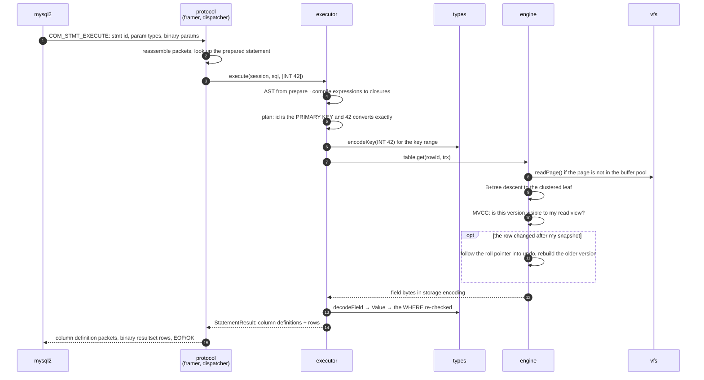

*Notice step 13: even after an exact key lookup, the whole `WHERE` is applied
again to the row. [§9](#9-from-text-to-rows) explains why that is a rule and
not a waste.*

Every arrow there has a document behind it: the packet in
[doc 16](./docs/16-prepared-statements.md), the binary values in
[doc 15](./docs/15-wire-types.md), the key encoding in
[doc 24](./docs/24-column-encodings.md), visibility and undo in
[doc 25](./docs/25-mvcc-and-undo.md). That was the purpose of the
documentation tree: much of this architecture is *format*, and format can be
found out.

## 7. Speaking MySQL

The protocol layer is the part of the system most likely to be used by people
who never touch the rest, so it is built to stand on its own.

**The handshake is real.** A client receives MySQL's `HandshakeV10` and
authenticates with `caching_sha2_password`, MySQL 8's default, or
`mysql_native_password`. Both work, through all of their branches, against the
real C client as well as `mysql2`. That turned out to matter: the C client
exposed two behaviours `mysql2` happily tolerates, an empty-password
response of `01 00` and a skipped `fast_auth_success`.

**But an in-process connection counts as already secure.** Authentication
exists here so that drivers work. It is not a security boundary for an
embedded database. Treating in-process connections as secure lets the
`caching_sha2_password` full path degenerate to compare-and-go: no RSA, no key
management. The RSA branch exists only for the Node TCP listener, which also
refuses to bind to anything but loopback unless an account with a password is
configured.

**We never compress a `memcpy`.** `CLIENT_COMPRESS` and `CLIENT_SSL` are never
advertised in-process. In the browser, transport security is `wss://`'s job.

**Unauthenticated input is capped.** `max_allowed_packet` (64 MiB) is enforced
per chunk *during* reassembly, not on the finished buffer. Connection
attributes are limited before authentication. Accumulated
`COM_STMT_SEND_LONG_DATA` is capped as well. Each cap bounds an allocation a peer
could force before proving anything about itself.

**Errors are MySQL's errors.** About 1,200 error numbers and their SQLSTATEs
are *generated* from MySQL's source, because transcribing them by hand is how
1451 and 1452 end up swapped. Only the facts are generated: number, symbol and
SQLSTATE. The English messages are MySQL's expression, not facts, so we write
our own for the codes we emit. An error reaches a caller in `mysql2`'s exact
shape (`code`, `errno`, `sqlState`, `sqlMessage`), so existing `catch` blocks
and retry loops work unchanged.

**Values come back exactly as `mysql2` would return them.** DECIMAL and TIME come
back as strings. BLOB comes back as `Uint8Array`. A BIGINT comes back as a
number when it is safe and a `BigInt` otherwise. JSON comes back parsed. Swapping a real
connection for ours must change nothing in the application.

**A statement is read in the client's character set, never assumed to be
UTF-8.** The protocol hands the dispatcher the statement's raw bytes, and the
dispatcher decodes them with the session's `Transcoder`. An early version
decoded everything as UTF-8, so a `latin1` client's `0x80` arrived as U+FFFD,
and the statement that ran was not the statement that was sent. The parser
keeps a byte-level lexer for the same reason: it has to see that a `gbk` lead
byte followed by `0x5C` is one character, not a backslash escape waiting to
open an injection.

## 8. The part everyone gets wrong: types and collations

MySQL's observable behaviour is dominated by things that look like details:
how a string compares, how a number converts, what happens to the trailing
spaces in `'a '`. Collation is not a detail, because **collation decides index
order, and index order decides results**. That is why `@myjs/charsets` and
`@myjs/types` were built and checked against a real server before the
executor existed.

A small example shows the stakes. Under `utf8mb4_general_ci`, the collation
most schemas from before MySQL 8 use, `'a' = 'a '` is **true**. Under
`utf8mb4_0900_ai_ci`, MySQL 8's default, it is **false**. So a `UNIQUE` index
that accepts both strings on one server refuses the second on the other. It is
one of the most common surprises when people upgrade MySQL, and an engine that
wants to be MySQL has to reproduce both behaviours, not pick one.

### Three shapes of a value

A value takes three shapes on its way through the system, and keeping them
apart has paid for itself several times:

| Shape | Lives in | Carries | Used for |
|---|---|---|---|
| `SqlValue` | `@myjs/bytes` | the plain value: number, bigint, string, bytes, date struct | the wire, and the driver-facing mapping |
| `StorageValue` | `@myjs/types` | what a column stores | encoding to and from record bytes |
| `Value` | `@myjs/types` | signedness, DECIMAL scale, a string's collation *and its coercibility*, and where a value came from when MySQL's rules depend on it | evaluating expressions |

`Value` exists because evaluation needs three things the other two shapes
erase. An integer's signedness matters, since negating an unsigned value
saturates. A DECIMAL's exact scale matters, since `1/7*7` is `1.0000` and not
`1.0003`. A string's coercibility matters, since a column's collation
beats a literal's. Where strings meet, at a comparison, CONCAT, IF or a
UNION, their collations are aggregated at compile time as MySQL's
`DTCollation::aggregate` does it, and a mix it cannot decide is the
statement's error (1267) before any row is read. A type that does not say its
coercibility is left out of that check rather than guessed at, so a missing
derivation can make a refusal disappear but never invents one. And sometimes where a value came from matters. An ENUM's
member index, a hex literal and a FLOAT column's precision ride along as
flags: an ENUM sorts by its index, `X'41' + 0` is 65, and a FLOAT(5,2)
holding 0.1 reads as `0.10` wherever it becomes text. `plainValue` strips
them where MySQL forgets them, at a user variable for example. The *rules* for all of this, meaning MySQL's choice of
comparison type, its arithmetic and its strict-mode refusals when assigning
into a column, live in `@myjs/types`, below the executor. An importer can
therefore store a value exactly as an `INSERT` would without running any SQL.

A strict mode has a second half that is the statement's, not the value's.
In an INSERT, UPDATE, DELETE, CREATE TABLE or ALTER TABLE without IGNORE,
MySQL raises some warnings as errors: `'abc' + 1` in an UPDATE's WHERE, a
division by zero, a logarithm of zero. Its `Strict_error_handler` decides
this for every condition at the one point they all pass through. Here that
point is the statement's list of conditions (`strict.ts`): the executor
chooses the list from the statement and the mode, and a list for a strict
statement throws when a listed code is pushed. No expression knows which
statement it is in.

### One property that makes the engine simple

The storage engine compares keys with `memcmp` and nothing else. It never sees
a type or a collation. That works only because `encodeKey` guarantees one
property for every type:

```
sign(compare(a, b))  ===  sign(memcmp(encodeKey(a), encodeKey(b)))
```

Integers and temporals are stored big-endian with the sign bit flipped, so
bytes sort the way numbers do. Floats are mapped to an order-preserving form.
Strings are replaced by their collation's *sort key*. A key with several
columns is the parts concatenated, and the primary key is appended to every
secondary entry:

```
 INDEX (name, age) on a table with PRIMARY KEY (id), name utf8mb4_0900_ai_ci

 ┌────┬──────────────────────────────┬────┬──────────────┬──────────────┐
 │ 01 │ sort key of name, 00 → 00 ff │ 01 │ age: big-    │ id: big-     │
 │    │ … then terminator 00 00      │    │ endian, sign │ endian, sign │
 │    │                              │    │ bit flipped  │ bit flipped  │
 └────┴──────────────────────────────┴────┴──────────────┴──────────────┘
   ▲     ▲                              ▲     ▲              ▲
   │     NO PAD text: prefix-free,      │     fixed width    the PK suffix:
   │     so the parts after it can't    │                    every entry is
   │     be confused with it            │                    unique, and the
   NULL flags: 00 for NULL, 01 for a value                   row can be found
```

*Each part is either fixed-width or prefix-free. That makes the
concatenation unambiguous and lets a `DESC` part be its ascending bytes
complemented.*

Getting that property genuinely true took two attempts, and both are worth
telling. MySQL's older collations are **PAD SPACE**: a shorter string is
compared as if extended with spaces. So `'a'` is *greater* than `'a\x01'`,
because the comparison sees `'a '` against `'a\x01'`, and `0x20 > 0x01`. No
variable-length sort key can express that. The fix is to give each PAD SPACE
key part a declared width and pad it with the collation's own pad weight,
which is what MySQL's own `strnxfrm` does.

MySQL 8's default collation, `utf8mb4_0900_ai_ci`, is **NO PAD**, and it
*expands*. `'ß'` weighs the same as `'ss'`, and some characters weigh eight
weights. A width large enough for every expansion would be enormous, and the
first design rejected `'Straße'` from a `VARCHAR(6)` key. So a NO PAD part
has no width at all. It is its sort key with every `00` byte written as
`00 ff`, followed by `00 00`. The terminator sorts below every continuation,
so the result stays in `memcmp` order and concatenates without ambiguity.

### Collations come from MySQL, not from the JavaScript engine

`Intl.Collator` is the obvious shortcut, and we reject it as a primary
source. It does not implement MySQL's tailorings, it does not produce a sort
key, and its behaviour changes with the JavaScript engine's version. That last
point is fatal: stored index bytes would depend on which browser wrote them.
Instead the collation registry and the weight tables are *generated* from
MySQL's own definitions and checked against a real server's
`WEIGHT_STRING()`. That check found a bug on its first run: `utf8mb4_bin`'s
sort key is three bytes per code point, not the raw UTF-8. Every ordering
test had passed anyway, because UTF-8 happens to preserve order.

Collations ship in three layers, by how often they are needed. The binary
collations and the small legacy tables (`utf8mb4_general_ci`,
`latin1_swedish_ci`) are always in the bundle. `utf8mb4_0900_ai_ci` is the
default, so it cannot be optional in practice. But its UCA tables are about
49 KB gzipped, more than we want in every initial bundle, so they sit in a
chunk that is loaded on demand. The accent-sensitive and language-specific
variants are opt-in modules. That raises a question: how does a lazy module survive a synchronous core? The answer is an explicit
`loadCollation()`, called on the async edge, for example when a `SET NAMES` is
handled or a table is opened. By the time a statement runs, everything it
needs is resident. A collation whose tables exist but have not been loaded
fails with its own error code. It is a different code from "not implemented",
because the two need opposite fixes: one means a missing feature, the other a
missing `await`.

## 9. From text to rows

### Parse once

The lexer is charset-aware (see the `gbk` example in §7), and the parser
produces a typed AST for the full statement grammar, administration
statements included. It is measured against MySQL's own test corpus: of the
17,589 statements in the curated census, every one a real 8.4 server accepts
also parses here, and the rest are statements MySQL itself refuses. MySQL's
reserved-word list is captured from a live server's
`INFORMATION_SCHEMA.KEYWORDS`, because reserved-ness is not written down
anywhere in MySQL's source. It falls out of the grammar.

A parsed tree is at most 1,000 levels deep. Left-associative chains such as
`a + b + c + …` are built by loops, so a tree can be as deep as its input is
long, and everything that later walks it recurses. One bound at parse time
keeps every consumer safe from stack overflow.

### Compile once per execution

A statement is parsed once, at prepare time, and **compiled once per
execution**. Each expression becomes a JavaScript closure, so the row loop
never walks the tree. The reason to compile at execute time and not at
prepare time is that the parameters change the answer: `SELECT ?` reports a
16,383-character string until it is bound and the bound value's type after,
and a range's bounds *are* the parameters' values.

### Refuse by name, never approximate

Query operators follow the Volcano model. Each one is a generator over the
rows of the one below it, so a `LIMIT 1` over a million-row scan reads one
row, and a join or a spilling sort can slot in without the rest noticing.

While the executor grows, it has one firm rule about what it can't do yet: it
**refuses by name, never approximates**. A `GROUP BY` the executor silently
dropped would be a wrong answer that looks like a right one. So an unbuilt
clause is refused naming the clause, and an unwritten builtin function is
`ER_NOT_SUPPORTED_YET` naming the function. An application meets a loud gap,
never a quiet difference. The order in which the gaps close is set by
measurement, not by a feature list: whatever stands between the ORM test
suites and a pass goes first.

### Warnings are part of the answer

A statement's warnings are part of what MySQL answers, and an application that
reads SHOW WARNINGS after an `INSERT IGNORE` is relying on them. Each statement
gets a diagnostics area: a list on the evaluation environment that storing a
value, `IGNORE`, the DDL deprecations and expressions all write to, with
MySQL's code and text. The session keeps the last one for SHOW WARNINGS and
`@@warning_count`. When a warning fires is part of the contract. Text read
as a number warns each time it is read, but a constant compared with a
number is converted once per statement. So the warning sits in the
conversion each operator wraps around its operand (`asNumber`), not in the
conversion functions of `@myjs/types`, which stay pure. Every corpus compares
each query's warning count.

### Plan conservatively

A planner that picks a range too wide costs time. One that picks a range too
narrow loses rows, and nothing downstream can notice. So the rule is strict.
**The whole `WHERE` is applied to every row an access path returns**, and the
planner narrows a scan only where the constant converts to the column's type
*exactly*. It narrows `int_col = 42`. It does not narrow `varchar_col = 1`,
which MySQL compares as doubles, or `float_col = 1.1`. The differential suite
includes a planted mutation, a planner that drops the `WHERE` after a range, and
the suite catches it.

The operators already run MySQL's own plans where the answer depends on
them. Hash joins build on the earlier table and emit a probe row's matches
newest first. A grouping chooses index order, a sort or a temporary table as
8.4.11 would. Each choice decides the rows' order and the metadata a client
sees, so the multi-table corpus records the server's `EXPLAIN` for every
query and compares row order wherever the plans agree. The target planner
goes further, along the same lines. It adds index selection with a cost
model, predicate pushdown, and join ordering, and its success criterion is
concrete: `EXPLAIN` should name the index a MySQL DBA would expect. Sorts
will spill when large, and MySQL's function library grows in the order the
ORM test suites use it. `INFORMATION_SCHEMA` is a set of derived tables
computed from the catalog when read. Their column definitions were captured
from the server, because no rule derives them. That is enough for Prisma's
introspection to rebuild a schema exactly.

### Statements are atomic; transactions are yours

InnoDB rolls back a failed *statement*, not its transaction. A multi-row
`INSERT` whose third row is a duplicate leaves nothing of the first two, and
the transaction's earlier work stands. We match that with a savepoint taken
before each statement. DDL commits the open transaction first, as MySQL's
does. When `multipleStatements` is negotiated *and* enabled on the engine
(it is off by default, because it turns an injection point into arbitrary
execution), statements run in order and the first error stops the rest.

## 10. Storage: a file you can trust

### Two files

A database is two files: a data file of 16 KiB pages and a log.

```
 data file                                            log file (a ring)
 ┌──────────┬──────────┬──────────┬──────────────┐    ┌─────────┬─────────┬─────────┬───
 │ page 0   │ page 1   │ page 2   │ page 3 …     │    │ block 0 │ block 1 │ block 2 │ …
 │ super-   │ super-   │ alloc-   │ B+tree pages │    │  4 KiB  │  4 KiB  │  4 KiB  │
 │ block A  │ block B  │ ation map│ in extents   │    └─────────┴─────────┴─────────┴───
 └──────────┴──────────┴──────────┴──────────────┘
  └─ written alternately; ─┘  one bitmap   the directory tree (index id → root
     open takes the newer      per 64-page  page), the catalog, undo, and every
     copy that verifies        extent       table and index
```

That is SQLite's shape, not InnoDB's file per table. One file needs the
fewest OPFS access handles, and a file per table is something interchange
needs, not storage. The 16 KiB page size *is* InnoDB's, so an imported page
maps one to one and three tree levels cover about a billion rows.

The superblock names the root of a **directory tree** that maps each index id
to its root page. A root page never moves. When it splits, its cells move down
into two new children and the root becomes their parent, as InnoDB does. So
the directory changes only when an index is created or dropped. Everything
else, including the catalog, the transaction directory and the undo logs, is
an ordinary tree or chain inside the same file. Pages are allocated in 64-page
extents tracked by bitmaps, and each tree keeps its leaves, its internal pages
and its overflow pages in separate segments, so a range scan stays physically
sequential. A small table draws its first pages from shared extents, so it
costs a few pages and not three whole megabytes.

Every page is self-identifying. It carries its own number, its type, the LSN
of its last change at *both* ends, and a CRC32C over everything after the
checksum. A torn write shows up as a checksum failure, or as head and tail
LSNs that disagree, with nothing in hand but the page.

### The B+tree is a map from bytes to bytes

The tree is an ordered, unique map from `Uint8Array` to `Uint8Array`,
compared with `memcmp`. That is all it is. A clustered leaf maps a primary-key
sort key to a record. A secondary entry is the secondary key followed by the
primary key, with a small value holding its own delete mark and the id of the
last transaction to change it.

Because the tree never sees a type, it can be tested exhaustively against a
JavaScript `Map`. Several of InnoDB's page-level structures went away once
we asked what they are for on the storage we target. InnoDB's sparse page
directory (one slot per four to eight records), its record linked list and its
infimum/supremum sentinels are replaced by a dense sorted slot array, so a
lookup is a pure binary search. Its on-disk free lists are replaced by a
bitmap allocator. There is no change buffer. Those structures were
optimisations for spinning disks and for gap locking, and we have neither.

Records, by contrast, keep InnoDB's framing for every column type, because
those encodings are shared with binlog row images and `.ibd` files. One codec
then serves the engine, the importer and the change stream.

Schema changes are where we depart from InnoDB again. MySQL 8's instant
`ALTER TABLE ADD COLUMN` puts a version byte in each *record*, which makes the
size of every record's null bitmap depend on the dictionary. We put the schema
version in the *page* header instead: every record on a clustered leaf is in
the version its page names. The first write to an older page re-encodes the
whole page through an upgrade function the layer above supplies. The `ALTER`
stays instant, the cost is paid once per page rather than once per row, and
any page can still be decoded with nothing but its own header.

### The log

The log is a ring of 4 KiB blocks, and each block checks itself:

```
 0        4        8                 16      18      20                   4096
 ┌────────┬────────┬─────────────────┬───────┬───────┬─────────────────────┐
 │ CRC32C │  salt  │ LSN of first    │ bytes │ first │ payload: groups of  │
 │ of 4.. │        │ payload byte    │ used  │ group │ redo records        │
 └────────┴────────┴─────────────────┴───────┴───────┴─────────────────────┘
```

Three rules make it safe on storage that might tear a write or lose an
unflushed one:

- **A written block is never written again.** A durable commit seals the block
  it ends in, padding included. Rewriting a half-full block in place, as InnoDB
  does, is safe only where a 512-byte sector write is atomic. On OPFS a 4 KiB
  write is not, and a torn rewrite would take an acknowledged commit with it.
- **Each block must continue the one before it**, with the same salt and an
  LSN exactly where the previous block's payload ended. A block that fails
  its checksum, carries a different salt or breaks the chain marks the end of
  the log.
- **The salt changes at every open.** A stale block from an earlier lap of the
  ring can never be mistaken for the next one, and that holds by
  construction rather than by probability.

What goes *into* the log is decided by the journal from §5. Redo is a byte
diff of each page against the snapshot the mini-transaction took. A page's
first change since it was last written to disk is logged as a **full image**.
That replaces InnoDB's doublewrite buffer: a page torn on disk always has an
intact image ahead of it in the log. Alongside the physical redo, each row
change also writes a logical `ROW` record with the row's whole before and after
images. Recovery ignores those. [§16](#16-the-log-is-a-product) explains why
they are there from the first version.

### Checkpoint and recovery

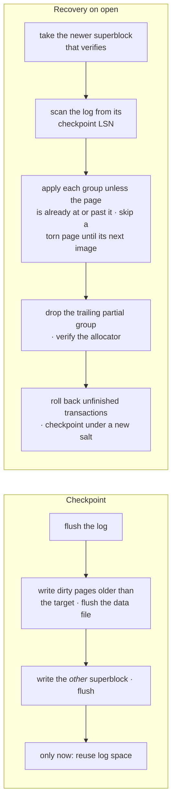

*The order of a checkpoint's steps matters. Log space is reused only after
the new superblock is durable, so a crash at any point leaves a superblock
whose log still exists.*

A checkpoint runs before a mini-transaction when the log is half full or three
quarters of the buffer pool is dirty. That is backpressure without a
background thread, which a synchronous engine does not have.

### Mini-transactions are all-or-nothing in memory too

The pages a mini-transaction changes stay pinned in the buffer pool until it
ends, and their snapshots serve as its undo. An exception anywhere inside it
restores every page *and* the state kept outside pages. There is one deliberate
carve-out: pages that were free before the mini-transaction started may be
written out early. That is what lets a single value larger than the whole
buffer pool be stored in one mini-transaction. Working out exactly which pages
qualify took a design review that broke the first draft. "Allocated here" does
not imply "free on disk" if the free that released the page is not yet durable.

Because a held page stays pinned, work that would be cheaper in one
mini-transaction is grouped by the pages it holds, not only by count. Purge
takes undo records into one while it holds under 8 pages. A multi-row INSERT
writes up to 64 rows into one while it holds under 16 (`trx.batch`). A batch
never takes a counter such as AUTO_INCREMENT's, since a counter is taken
outside any mini-transaction, and when a row in it fails the whole batch rolls
back with the statement.

## 11. Transactions with one writer

### The writer slot

The single biggest simplification in the design is that **there is one
writer**. Readers run concurrently through MVCC. Writers take turns.

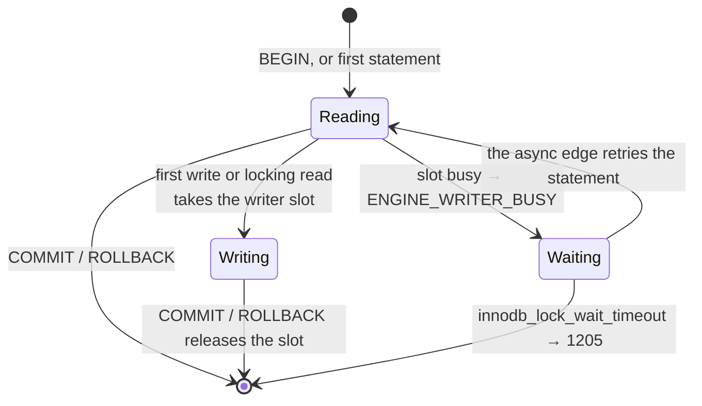

*The engine answers "busy" immediately. Waiting is the async edge's job,
which is ground rule 3 in action.*

There is no lock manager, no deadlock detector and no two-phase locking. The
reasons:

- The browser forces it. OPFS sync access handles are exclusive, and the
  shared-write mode exists only in Chrome.
- It matches the deployment model: one application, one database.
- It removes the class of bugs where database engines actually go wrong.

What we give up is parallel write throughput. On every platform we target,
that is bounded by `flush()` anyway.

A writing statement takes the slot *before it does anything else*. So if the
slot is busy, nothing has changed yet, and running the whole statement again
later is exactly equivalent to having waited. That is how the async edge
implements `innodb_lock_wait_timeout` without the engine ever blocking. When a
connection ends, whether by `COM_QUIT`, a destroyed stream or a closed socket,
its transaction rolls back. A dead client can't hold the slot forever.

One writer would be a poor bargain if a long statement also held the event
loop: a 32,000-row INSERT used to keep every other connection, handshakes
included, waiting for three seconds. So a statement may **pause between its
mini-transactions** (D-77). The core stays synchronous; a statement that may
run long is a generator that yields only where no mini-transaction is open,
and the async edge resumes it a ten-millisecond slice at a time. A writer
pauses holding the slot, so nothing else can change a page under it, and the
state it leaves between two batches is the state between two statements of
an open transaction, which other sessions already see correctly. A read
pauses every 256 rows holding nothing, and if a commit changed the tree
meanwhile its scan finds its place again by key (M5.38). A connection that
closes while its statement is paused has the statement interrupted at the
pause, and it rolls back as on any error. Purge is cut to fit: a commit
purges a bounded number of undo records, and the rest is purged a slice at
a time while no writer holds the slot.

### Reading the past

Each clustered record carries the id of the transaction that last wrote it and
a roll pointer into undo, in InnoDB's own layout. `REPEATABLE READ` takes a
read view at its first consistent read, and `READ COMMITTED` takes one per
statement. A reader that finds a version too new for its view follows the roll
pointer and rebuilds the version it is allowed to see.

Undo is kept **per index entry, not per row**. An undo record says "index *i*:
key *k* was inserted" or "key *k* had value *v*", and it holds the old value
whole. That keeps rollback, crash recovery and purge as schema-blind as the
tree: none of them needs the catalog. An update writes every off-page value
afresh, so each overflow chain belongs to exactly one version and is freed by
exactly one path, purge or rollback, never both. A design review found the
double free that the alternative would have caused.

### The errors applications expect

Applications and ORMs are written around MySQL's concurrency errors, so we
raise them even though our machinery is different:

| Error | MySQL means | Here it means |
|---|---|---|
| **1205** `ER_LOCK_WAIT_TIMEOUT` | waited too long for a row lock | waited too long for the writer slot |
| **1213** `ER_LOCK_DEADLOCK` | chosen as a deadlock victim; retry | your read view expired because history grew past `maxHistory` commits; retry |
| **1062** `ER_DUP_ENTRY` | unique key violation | the same |

One writer cannot form a lock cycle, so 1213 never means deadlock here. It
still means "start this transaction again", which is exactly what an ORM's
retry loop will do. History is bounded in *commits* (10,000 by default), not
seconds, because commits are what grow the store, and a wall-clock limit
belongs to the host.

### DDL is a transaction too

`CREATE TABLE` and `DROP TABLE` write undo like rows do. A rolled-back
`CREATE` drops its trees, and a committed `DROP` frees its trees at purge. So DDL is
crash-atomic by the same path every row takes. A table's definition is a row
in a system table. The catalog itself is described by code (a few reserved
index ids and fixed layouts) and versioned with the store format. A format
change is a new number and a documented migration, never a guess.

`ALTER TABLE` is a copy. `Catalog.rebuildTable` makes the changed table and
passes every row through a function into it. It carries the AUTO_INCREMENT
counter over and drops the old table, all in one DDL transaction. A row the
new definition refuses, such as a duplicate under a new UNIQUE key or a child
with no parent under a new foreign key, rolls the whole thing back. MySQL
does many of these changes in place. A client can tell only from the
"Records" count, so we report the count MySQL would.

Foreign keys are enforced above the engine, in one place. Every INSERT,
UPDATE, DELETE, REPLACE and upsert writes through a guarded `Table`, which
checks a child's parent after the write and fires the actions on a parent's
children before it. A failed check is an error like any other, so the
statement's savepoint undoes the cascade with the write that caused it.

## 12. Durability, stated honestly

A database's first duty is not to lose what it acknowledged. Its second is to
be honest about the conditions under which it might. Here is what
`flush()` buys on each platform:

| Platform | `flush()` is | Real guarantee |
|---|---|---|
| Node, Bun, Deno | `fsyncSync` | Strong, short of drive caches; macOS needs `F_FULLFSYNC` for strict |
| OPFS sync handle | `handle.flush()` | Best-effort |
| OPFS async fallback | stream close | An atomic replacement of the whole file, only |
| IndexedDB fallback | transaction commit | Strong, within IndexedDB's own model |
| Memory | nothing | None |

Because the platform can't always be trusted, the format defends itself in
five ways: a CRC32C on every log block and data page, a continuous LSN chain
in the log, full-page images instead of a doublewrite file, two alternating
superblocks, and head-and-tail LSNs on every page. Together they turn
"best-effort flush" from *the database may be corrupt* into *the last few
commits may be lost*. The second is a guarantee we can state.

As in InnoDB, the trade between speed and safety is
`innodb_flush_log_at_trx_commit`, here `flushLogAtTrxCommit`: `1`
flushes at every commit, `2` writes at commit and flushes once a second, and
`0` does both once a second. A synchronous engine owns no timer, so the host
calls `Store.sync()` for the once-a-second tick.

The promise, in full:

> On Node with `flushLogAtTrxCommit = 1`, a committed transaction survives a
> crash. In the browser, a committed transaction survives a tab crash; a small
> window of recent commits may be lost on an OS crash or power loss. **In no
> case can the database become corrupt.**

The Node half is tested. A fault-injecting VFS crashes the engine at 10,000
points in CI, modelling both a process crash and a power loss in which each
unflushed write independently survives, is torn at a 512-byte sector, or is
lost. It checks all three flush settings. The browser half rests on an
assumption we have not yet verified. We assume an OPFS `flush()` may *lose*
writes but never *reorders* them across itself. If a page write could become
durable while an earlier log write did not, the write-ahead rule would be
void. Real-browser crash tests settle that question, and until they have,
we say so. If the answer turns out to be yes, a page would need to be
recognisable as running ahead of its log without consulting the log, and
nothing in the format does that yet.

## 13. Engines behind one interface

MySQL's `handler` interface has about a hundred virtual methods. Ours is
deliberately small:

```ts
interface StorageEngine {
  readonly name: string
  readonly transactional: boolean
  readonly consistentReads: boolean
  create(def, trx): TableDef
  open(def, hooks): Table
  drop(def, trx): void
  discard(def): void
}

interface Table {
  insert(row, trx?): RowId
  update(id, row, trx?): RowId | undefined
  delete(id, trx?): boolean
  duplicateOf(index, row, trx?): RowId | undefined   // which row a 1062 means
  get(id, trx?, mode?): FieldBytes[] | undefined
  scan(range?, trx?, mode?): Generator<[RowId, FieldBytes[]]>
  indexScan(index, range?, trx?, mode?): Generator<[RowId, FieldBytes[]]>
  nextAutoIncrement(count?): bigint
  stats(): TableStats
}
```

Rows cross this interface as field bytes in storage encoding. The executor
never learns how an engine keeps them.

| Engine | What it is | Status |
|---|---|---|
| `native` | The B+tree, MVCC and WAL store described above | built |
| `memory` | Sorted arrays in process memory. Not MySQL's MEMORY engine: it keeps BLOBs and returns rows in key order. Non-transactional, and says so in its flags | built |
| `innodb-ro` | Query an imported `.ibd` in place, without copying it into native storage | planned |
| `csv` | MySQL's CSV engine, for import and export | planned |

The `memory` engine is written *independently* of `native`, and that is the
interesting part. It orders rows by comparing *values* using a collation's
`compare` function. It never uses encoded keys. Two engines that both ordered
by `encodeKey` would pass a differential test with the same bug in both. Two
engines that order by different means can disagree, and when they do, one of
them is wrong. A shared conformance suite runs against both, so `memory` serves
as a measuring instrument for `native`'s key encoding as well as an engine.

`duplicateOf` is a good example of where the line falls. An upsert has to
update the row a duplicate-key error refers to, and `REPLACE` has to delete
it, but a 1062 names only an index. Re-encoding the key in the executor to
find the row would duplicate the engine's encoding logic outside the engine.
So the engine is asked directly, using the same key code it checks uniqueness
with. Which key is reported when a row collides with two, and which row an upsert
updates, follow MySQL's own ordering of unique keys: PRIMARY first, NOT NULL keys
before nullable ones, keys without a prefix part before keys with one, and
then the order they were declared.

## 14. Where it runs

The database is owned by **exactly one context** at a time. Everyone else is a
client speaking the wire protocol over a port. That is not a limitation we
apologise for. It is PGlite's worker model too, and it is what keeps durability
reasoning tractable.

The browser comes late in the build order on purpose. OPFS is just another
VFS backend, and the engine has been built and crash-tested against memory and
Node first. If the VFS interface is right, the browser is a fortnight of work.
If it is wrong, no amount of browser work saves it.

### In the browser

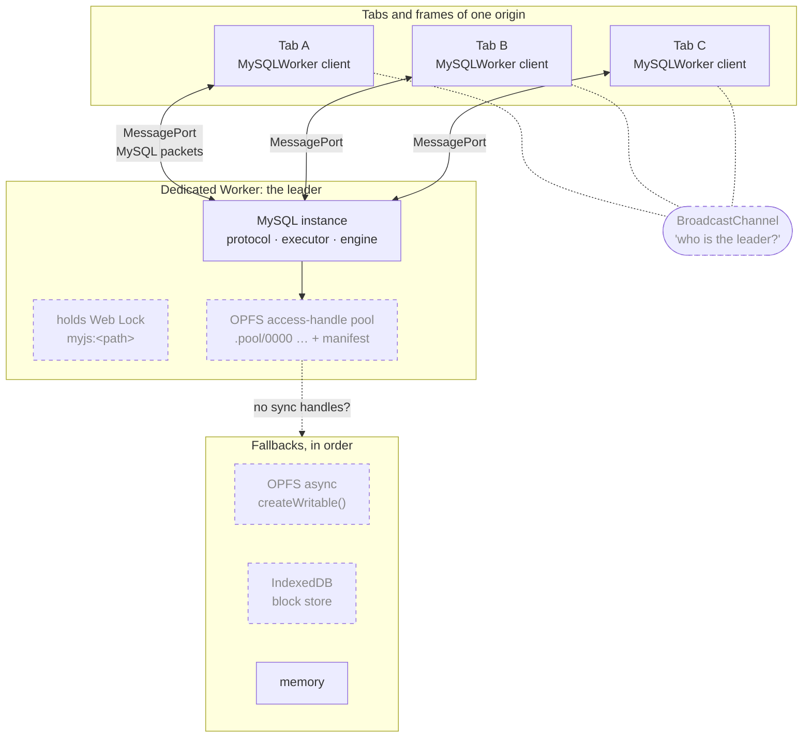

*Every tab speaks the same protocol to the leader, whether or not the leader
is in its own process. The leader is just a context that won the lock.*

OPFS sync access handles exist only inside a dedicated Worker, so that is
where the database lives. Acquiring a handle is asynchronous and exclusive
for the whole origin, so handles are opened once, up front, into a **pool**
of opaque files with a manifest mapping logical names to slots. This
technique comes from PGlite and wa-sqlite, and it makes opening a logical
file after startup synchronous. Chrome may close handles when a tab is
suspended, so the VFS detects that and re-acquires them. Where sync handles
do not exist, the chain falls back to the async OPFS API, then to an
IndexedDB block store (Safari's private browsing has no OPFS at all), then to
memory.

Leadership uses Web Locks. The browser releases a lock when the context
holding it dies, so failover needs no heartbeat:

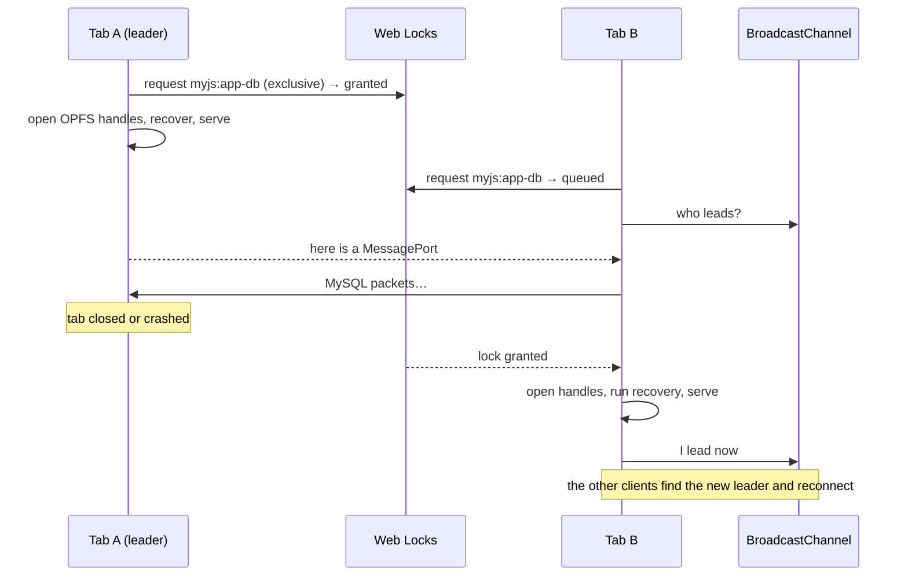

`MySQLWorker` has the same interface as `MySQL`. Swapping one for the other
changes no application code. `SharedArrayBuffer` is never required, because
cross-origin isolation is too high a price for a library.

### In Node, Bun and Deno

The default is the simplest possible: the engine runs in the calling thread,
and the Node VFS uses `openSync`, `readSync`, `writeSync` and `fsyncSync` at
page offsets. An advisory lock file holding the owner's pid, with staleness
detection, keeps two processes from opening one database. To serve other
processes, or the `mysql` command-line client, `@myjs/server` wraps the same
`execProtocol` in a TCP listener:

```js
import { serve } from '@myjs/server'
const server = await serve(db, { port: 3306, host: '127.0.0.1' })
// $ mysql -h 127.0.0.1 -P 3306 -u root
```

A WebSocket bridge, so a browser can reach a Node-hosted database, and a
`worker_threads` host will complete the server package.

## 15. Bringing your data: InnoDB interchange

Most people who want an embedded MySQL already have a MySQL somewhere.
`@myjs/innodb` is how their data gets in and out. It reads and writes real
`.ibd` tablespaces in the COMPACT and DYNAMIC row formats, reads REDUNDANT for
old files, and pairs each with its `.cfg` metadata. That is the transportable
tablespace boundary from §3.

Reading a real tablespace inverts the order in which we built our own engine:
the dictionary comes *first*. You cannot read a single row until you know
where the index roots are and what the columns look like, and both live in
the tablespace's serialized dictionary (SDI):

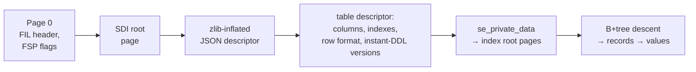

*Each step needs the one before it. Without the descriptor, not one row can
be read.*

Since our records already use MySQL's column encodings byte for byte (all of
them, binary JSON included), the importer has no separate value codec. A
DECIMAL read from an `.ibd`, a DECIMAL in a binlog row image and a DECIMAL in
our own record are the same bytes. The success criterion is a round trip
through a real MySQL 8.4 server, in both directions, with byte-identical
values.

For everything that is not a tablespace there is a `mysqldump` reader and
writer. There is also a native `dump()` / `MySQL.load()` pair for seeding a
database from a build artefact, which opens without running recovery.

## 16. The log is a product

The `ROW` records in §10 cost real bytes in every commit, and recovery never
reads them. They are there because a write-ahead log that carries whole
logical row images is a change stream, and we decided to have one from the
first version of the log format rather than retrofit it later.

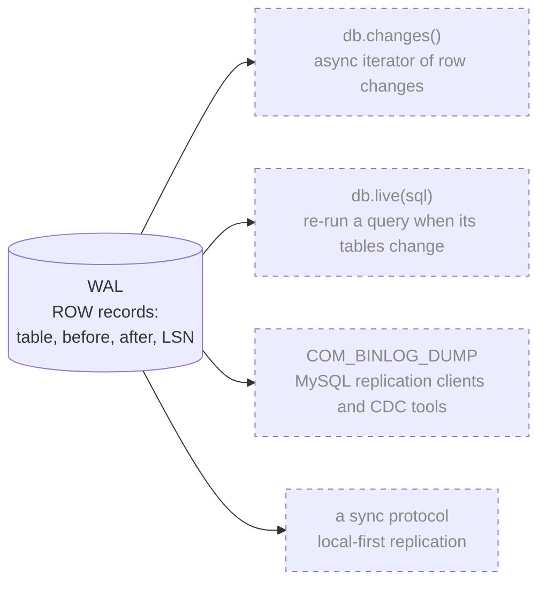

*Everything on the right is a projection of something already on disk.*

The images are *whole*: values stored off-page are read back into the record.
A change stream can't follow a pointer to pages that a later transaction may
already have freed. The field encoding is MySQL's text-row format, so the bytes
are already ones a MySQL client knows how to read. A test already rebuilds a table from
its `ROW` records alone.

Emitting the stream in the *shape* of MySQL's binlog, as table-map and row
events, means change-data-capture tools built for MySQL can follow it
without modification. Serving that over `COM_BINLOG_DUMP` is what turns "sync
a browser database to a server" into an extension rather than a rewrite. Going
the other way, a standalone binlog reader (`@myjs/binlog`) lets an existing
MySQL's changes be replayed into an embedded copy.

## 17. The API you hold

The convenience API is deliberately shaped like `mysql2/promise`, because that
is the API JavaScript developers already know. Familiar beats novel.

```js
import { MySQL } from 'myjs'
const db = await MySQL.open('./data', { flushLogAtTrxCommit: 1 })

// queries
const [rows, fields] = await db.query('SELECT * FROM users WHERE id > 10')
const [result] = await db.execute('INSERT INTO users (name) VALUES (?)', ['alice'])
result.insertId

// never held whole (M5.40, in 0.4)
for await (const row of db.stream('SELECT * FROM big_table')) { /* … */ }

// transactions: commit on return, roll back on throw,
// and retry on 1213 a bounded, configurable number of times
await db.transaction(async (tx) => {
  await tx.execute('UPDATE accounts SET balance = balance - ? WHERE id = ?', [10, 1])
  await tx.execute('UPDATE accounts SET balance = balance + ? WHERE id = ?', [10, 2])
})

// the protocol, for drivers and transports
db.execProtocol(bytes)        // Uint8Array → Promise<Uint8Array>
db.createStream()             // a duplex for mysql2's { stream }
db.createPort()               // a MessagePort for another thread or tab

// data in and out: not in 0.3 (M6.8, M7.10–M7.12)
await db.importTablespace('users', ibdBytes, cfgBytes)
const { ibd, cfg } = await db.exportTablespace('users')
const snapshot = await db.dump()
const copy = await MySQL.load(snapshot)

// change streams: not in 0.3 (M8.1)
for await (const c of db.changes({ tables: ['orders'] })) { c.type; c.before; c.after; c.lsn }
```

Automatic retry happens **only** inside `transaction()`, where replaying the
callback is safe. Errors carry MySQL's numbers and SQLSTATEs in `mysql2`'s
shape everywhere. Introspection (`explain()`, `stats()`, and real `SHOW` and
`INFORMATION_SCHEMA`) reads the same numbers the engine already keeps. The
full surface is in [doc 42](./docs/42-public-api.md), with a table of what
0.3 builds of it. `query<T>()` and `execute<T>()` take the caller's row type,
as `mysql2`'s do, and `createStream()` is typed by its host (D-78): a Node
`Duplex`, or Web Streams in a browser bundle.

There is one place where the seam from §5 and this surface pull against each
other. `execProtocol` returns every response byte for one command, which is
right for nearly everything and wrong for `db.stream()`, whose whole purpose
is never to hold a large resultset in memory. A streaming variant of the
lowest entry point was one of the open questions in [§20](#20-what-we-dont-know-yet).
The answer (D-85) left `execProtocol` whole and made every hop below the
API pull instead: a read that stops every 256 rows (§11) hands those rows
out as it goes, the dispatcher sends a batch only when the connection asks,
and a connection whose transport reads as it writes waits while 64 KiB is
unread. A reader that stops taking stops the statement.

## 18. How we know it works

A database is a long list of claims, and every one of them is easy to make.
So the most important part of this architecture may be the instruments that
check the others. They are designed in from the start, not added at the end.

**A real MySQL in the loop.** Most of what this project knows about MySQL that
no document states came from asking a server. One exact build, 8.4.11, is
pinned so that committed corpora can be reproduced, not just resembled. From
it we capture:

| Corpus | What it pins down |
|---|---|
| Protocol traces | Full client/server byte exchanges, recorded through a proxy and replayed byte for byte |
| Storage vectors | Column encodings from binlog row images; sort keys from `WEIGHT_STRING()` |
| Precedence | 1,200 generated expressions, evaluated by the server |
| Queries | 1,200 generated joins and set operations |
| Execution | 400 generated scripts run through `mysql2`; every statement's rows, order, metadata, `affectedRows`, `insertId`, errno and SQLSTATE must agree |
| Keywords | MySQL's reserved-word list |
| Functions | 200 scripts of string and numeric function calls over every type, both protocols |
| Date and time functions | 300 scripts of the date and time functions over every temporal type, text and numbers, in UTC, both protocols, warning counts compared |
| More functions | 300 scripts of the remaining string, math, hashing and network functions (CHAR, FIELD, FORMAT with locales, CONV, base64, the digests, LOG and the trigonometry, INET and UUID), both protocols, warning counts compared |
| Temporal text | 2,700 generated strings stored into DATE, DATETIME, TIME and TIMESTAMP, strictly and under IGNORE, each with its SHOW WARNINGS |
| `INFORMATION_SCHEMA` | 120 DDL scripts, each followed by the introspection queries Prisma and Drizzle send: 2,568 statements |
| Feature scripts | Hand-written scripts, each run on the server first with its answers kept: foreign keys, CHECK, ALTER TABLE and defaults, SHOW CREATE TABLE, JSON paths, REGEXP and ICU's pattern syntax, collation mixes, temporal comparisons, BIT |

Our code is never the oracle for itself. When a behaviour is in doubt, the
server settles it, and the answer becomes a fixture.

**MySQL's own tests, without copying them.** MySQL's `mysql-test` corpus is
fetched in CI and never vendored. A census lexes and parses every statement
in it. The committed record holds names, hashes and counts, never a line of
corpus SQL. The target is a curated subset of `.test`/`.result` pairs
executed and diffed, with the pass rate as a headline number.

**Crashes on purpose.** The fault-injecting VFS from §12 kills the engine at
10,000 points per CI run. Every recovery must reach the state after some
whole step, verify, and lose no acknowledged commit. In the browser, real
page kills in Chrome, Firefox and Safari will do the same job, and settle the
one assumption the fault model cannot.

**Fuzzing.** Packets, SQL text, the executor, page decoders and the log are
all fuzz targets, and the invariant is ground rule 5: a typed error, never a
crash. The executor fuzzer's first run found a column definition the engine
would store and then could not read back.

**A scoreboard written by CI.** Every compatibility number, from mysqltest pass
rate and driver suites to traces, storage vectors, crash points and bundle
size, lives in one table that changes in the same commit as the code. A
number updated by hand, later, is marketing.

**Reviews that must reproduce.** A finished feature is handed to a reviewer
whose only job is to break it, with the server beside it. A finding counts
only once it has been reproduced against 8.4.11, and it is fixed by adding the
server's answer to a captured script, not by editing code until the symptom
goes away. One review of the foreign-key, ALTER, CHECK and JSON work found
twelve divergences. Among them was a cascade that wrote NULL where InnoDB
refuses: silent data loss that every existing test had passed. Fixing them
turned up three more, in places nobody had been looking: ENUM in a numeric
context, two-digit years, and `\w` in a regular expression.

**Mutations that must be caught.** A test suite that passes is evidence only
if it *could* fail. So the suites are tested too. We plant a bug, such as
`memcmp` in place of a collation, affected rows reported as changed rows, or a
`WHERE` dropped after a range, and confirm the suite catches it.

Behind all of this is a habit. Almost every lesson in the project's changelog
has the same shape: a claim was checked against something real, the check
found a bug, and the bug was often **in the test rather than in the code**.
The ordering tests that passed because UTF-8 happens to preserve order. The
evaluator that never saw `DIV` promote to unsigned because it skipped
refusals. The GitHub API listing that silently stopped at 1,000 entries and
flattered every number downstream of it. So when a check fires, the first
question is whether the instrument is the thing that is broken.

## 19. What we gave up, on purpose

Every architecture is a set of trades. These are ours, stated so that nobody
discovers them by surprise.

| We gave up | It costs | We accept it because |
|---|---|---|
| **Multiple concurrent writers** | Parallel write throughput | Browsers forbid it in practice, the deployment is one app and one database, and `flush()` is the bottleneck anyway |
| **Bug-for-bug fidelity** | Some optimiser quirks and edge cases will differ | We target observable 8.0/8.4 behaviour, measured by differential tests. Each known divergence is written down |
| **Whole-datadir compatibility** | You can't point `mysqld` at our files | MySQL doesn't promise it across its own versions. Transportable tablespaces are the documented boundary |
| **Executing stored routines and triggers (initially)** | Applications that rely on them | They parse and are stored. Execution comes when users pull it forward |
| **The COMPRESSED row format** | Reading compressed tablespaces | Page compression at the VFS layer is the better design for our storage |
| **`SharedArrayBuffer` and cross-origin isolation** | Some multi-threaded designs | It breaks embeds, and a library can't ask every host to change its headers |
| **The X Protocol** | `mysqlx` clients | The JavaScript ecosystem speaks the classic protocol |
| **Being a production server** | Clusters, replication as a source or replica | This is an embedded database that happens to be MySQL-shaped |

## 20. What we don't know yet

A design document that has answered everything is either finished or not
being honest. These are the questions this one still carries. Each is pinned
to the milestone that has to answer it, because a question with a deadline is
a blocker and one without is just a note.

| Question | Why it matters | Settled by |
|---|---|---|
| **Does OPFS `flush()` ever reorder writes?** | The browser half of the durability promise depends on it ([§12](#12-durability-stated-honestly)) | Real-browser crash tests, M6 |
| ~~**Does `execProtocol` need a streaming variant?**~~ **Answered (M5.40, D-85): no.** `execProtocol` stays whole; a connection whose transport reads as it writes gets the stream, with backpressure at every hop | | M5.40 |
| ~~**How faithful must `INFORMATION_SCHEMA` be?**~~ | Settled by M5.12: byte for byte, metadata included, because Prisma diffs what it reads against what it pushed. A captured corpus of 2,568 statements agrees in full | — |
| ~~**How closely can our byte traces match a real server's?**~~ | Settled by M5.16: what is compared with a real server is what a client sees — rows, metadata, counters, errors and warnings — and byte identity is held only against our own frozen traces | — |
| **Is whole-page compression at the VFS the answer to COMPRESSED tables?** | It is the proposed replacement, with no design yet | M6 or later |
| **Do index pages get prefix compression?** | Could save a third or more on string keys, at the cost of a slower page format | M7, which reads InnoDB's own pages |
| **How are legacy temporal types told apart on import?** | Their byte lengths overlap the modern forms, so the dictionary has to decide | M7 |

## 21. Where we are

*A snapshot as of 2026-10-09. The [roadmap](./docs/44-roadmap.md) is the live
version, and wins wherever it disagrees with this section.*

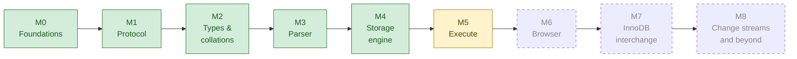

M0 through M4 are done. The protocol, the type system and collations, the
parser and the storage engine are all built and checked against a real
server. M5's exit criterion is met. The executor runs DDL, DML and
transactions, upserts and multi-table UPDATE and DELETE included, with a
strict mode's errors where the server raises them. It runs relational
SELECT: joins, grouping and aggregates, subqueries, derived tables, CTEs, set
operations and views. It also covers JSON as a value, window functions with
their frames, `INFORMATION_SCHEMA`, SHOW, foreign keys with their
referential actions, CHECK constraints, ALTER TABLE by copy, temporary
tables, generated columns, FULLTEXT, `SHOW CREATE TABLE` byte for byte, JSON
paths and regular expressions. Generated corpora agree with MySQL 8.4.11
statement for statement, column names and flags included. Drizzle's MySQL
suites pass whole, as they do against 8.4.11, and so does every test of
Prisma's that 8.4.11 passes, file for file, three runs in a row, now that a
bulk statement pauses between its batches instead of stalling every other
connection (§11). The query API of §17 exists, typed, and a client of the
wire protocol whose answers are compared with `mysql2/promise`'s. `myjs`
packs, installs into an empty project and runs there, in CI; 0.3 waits only
on being published. The cost-based planner is built: statistics stored by
ANALYZE, MySQL's cost model choosing access paths and join order, and
`EXPLAIN FORMAT=TREE` printed from the same tree of iterators that runs,
agreeing with 8.4.11 on 2,082 of 2,248 plans. `db.stream()` streams a
million rows within a few MB of the heap's baseline (M5.40). Next is the
browser. The core bundle is about 290 KB gzipped against a budget of 500 KB,
with the UCA weights in a separate chunk loaded on demand.

The release plan gives each stage something to ship:

| Release | Ships | Unlocked by |
|---|---|---|
| 0.1 | `@myjs/protocol` and `@myjs/bytes`: a standalone MySQL protocol toolkit | M1 |
| 0.2 | `@myjs/charsets`, `@myjs/types`, `@myjs/parser` | M2, M3 |
| 0.3 | `myjs` itself: real storage, real execution, Node | M4, M5 |
| 0.4 | The browser: OPFS, workers, `myjs/worker` | M6 |
| 0.5 | `@myjs/innodb` and import/export | M7 |
| 1.0 | Every scoreboard target met, and the API frozen | — |

## 22. Further reading

This paper is the overview. The numbered documents in [`docs/`](./docs/README.md)
are the specifications, each written against MySQL's source rather than from
memory:

| If you want… | Read |
|---|---|
| The case for reimplementing | [02 Strategy](./docs/02-strategy.md), [01 Prior art](./docs/01-prior-art.md) |
| The compact reference version of §4 | [03 Architecture](./docs/03-architecture.md) |
| The wire protocol, byte by byte | [10](./docs/10-protocol-overview.md)–[18](./docs/18-binlog.md) |
| How MySQL stores a value | [24 Column encodings](./docs/24-column-encodings.md), the one to read if you read only one |
| Collations and why they decide order | [29 Charsets and collations](./docs/29-charsets-and-collations.md) |
| MVCC, undo, redo and recovery | [25](./docs/25-mvcc-and-undo.md), [26](./docs/26-redo-and-recovery.md) |
| InnoDB's file and page formats | [21](./docs/21-innodb-file-layout.md)–[23](./docs/23-innodb-row-formats.md), [27](./docs/27-data-dictionary.md), [28](./docs/28-json-binary.md) |
| The VFS, durability and concurrency | [40](./docs/40-vfs.md), [41](./docs/41-durability-and-concurrency.md) |
| The public API | [42](./docs/42-public-api.md) |
| Testing | [43](./docs/43-testing.md) |
| Every decision, with its reasoning | [44 Roadmap](./docs/44-roadmap.md), the decision log |
| A word you don't know | [91 Glossary](./docs/91-glossary.md) |
